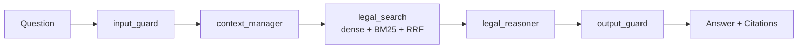

# Legal RAG Assistant

 

> Evidence-based agentic RAG assistant for Indonesian labour law.

## Overview

**Legal RAG Assistant** answers questions about Indonesian labour law (*Hukum Ketenagakerjaan*) by retrieving actual statutory articles and citing them — `UU / Pasal / Ayat` — instead of guessing. An **agentic workflow built with LangGraph** runs five nodes around the language model, with **guardrails on both ends**: an input guard blocks prompt injection and abusive requests, and a two-layer output guard blocks hallucinated article references.

## Demo

<!-- TODO(demo): replace the line below with a screenshot or GIF, e.g.
      -->
_Screenshot / GIF — coming soon._

**Live demo:** <!-- TODO(demo): replace with the real Cloud Run URL -->_[coming soon]_

## Features

**Data ingestion**
- Hierarchical **parent–child chunking** (parent = full *Pasal*, child = per *Ayat*)

**Retrieval**
- Query rewriting & decomposition into sub-queries
- Metadata filtering (`status_keberlakuan`, target UU)
- Multi-query search, run **in parallel** (`asyncio.gather`)
- **Hybrid search**: dense (semantic) + sparse (BM25), fused with **RRF**

**Generation & safety**
- Evidence-based reasoner with **mandatory citations**; refuses when no evidence exists
- **Input guard** (prompt injection / hate speech) and **output guard** (regex article check + Gemini semantic audit)

**Product**
- Chit-chat routing, 5-turn conversation context, streaming (SSE) with live node status, citation sidebar
- LangSmith tracing, Ragas evaluation, multi-document knowledge base

## Architecture

The flow below is the compiled LangGraph state machine; each box maps to a file in `src/agent/nodes/`.



Full detail (per-node behaviour, data model, SSE flow, design trade-offs) is in **[`docs/ARCHITECTURE.md`](docs/ARCHITECTURE.md)**.

## Tech Stack

| Layer | Technology |
| --- | --- |
| Language & tooling | Python >=3.12, `uv`, Ruff, pytest, pre-commit |
| Backend | FastAPI + Uvicorn (async, SSE) |
| Agent orchestration | LangGraph + PostgreSQL checkpointer |
| LLM & embeddings | Google Gemini (`google-genai`) |
| Vector DB | Qdrant (dense + sparse/BM25, RRF) |
| Relational DB | PostgreSQL (chat sessions, audit logs) |
| Frontend | Chainlit |
| Observability | LangSmith |

## Project Structure

```
├── src/            # FastAPI app, agent nodes, database, utils
├── ingestion/      # Legal text → Qdrant pipeline (mock/ is active)
├── ui/             # Chainlit frontend
├── tests/          # unit/ + integration/
├── evaluation/     # Ragas evaluation scripts
├── docs/           # ARCHITECTURE.md, DEPLOYMENT.md
└── Makefile        # developer commands (make help)
```

## Prerequisites

- Python **3.12+** and **[`uv`](https://docs.astral.sh/uv/)**
- **Docker** (Docker Compose) for local Qdrant + PostgreSQL
- API keys: **Google Gemini** (required), Qdrant Cloud / LangSmith (optional for production)

## Getting Started

```bash
# 1. Install dependencies
uv sync

# 2. Configure environment
cp .env.example .env.development
#    -> edit .env.development and add your GEMINI_API_KEY (etc.)

# 3. Start local databases (Qdrant + PostgreSQL)
make up

# 4. Create the Qdrant collection and load sample legal data
make init-qdrant
make ingest            # needs a valid GEMINI_API_KEY (embeddings)

# 5. Run the backend (http://localhost:7000) and UI (http://localhost:8000)
make run-app           # terminal 1
make run-ui            # terminal 2
```

Then open **http://localhost:8000**. Run `make help` to list every available command.

## Configuration

`src/config.py` loads the file **`.env.<APP_ENV>`**, where `APP_ENV` comes from your **shell/Makefile** (default `development`) — it is *not* read from the file itself. Copy `.env.example` to `.env.development` before running.

| Variable | Purpose | Required |
| --- | --- | --- |
| `GEMINI_API_KEY` | LLM + embeddings | ✅ |
| `QDRANT_URL` | Vector database endpoint | ✅ |
| `POSTGRES_URL` | Session memory + audit logs | ✅ |
| `LANGSMITH_API_KEY` | LangSmith tracing | ✅ (even if tracing is off) |
| `QDRANT_API_KEY` | Qdrant Cloud only | optional |
| `LANGSMITH_TRACING` | Enable tracing (`true`/`false`) | optional |
| `BACKEND_URL` | UI → backend base URL | optional (UI defaults to `http://127.0.0.1:7000`) |

## API Usage

| Method | Path | Description |
| --- | --- | --- |
| `GET` | `/health` | Health check |
| `POST` | `/api/v1/chat` | Chat (Server-Sent Events stream) |

```bash
curl -N -X POST http://localhost:7000/api/v1/chat \
  -H 'Content-Type: application/json' \
  -d '{"message":"Berapa pesangon untuk masa kerja 1 tahun?","session_id":"demo-1"}'
```

The stream emits `node_complete` events while each node runs, then one `final_result` event containing `final_answer`, `system_status`, `is_chitchat` and `citations[]`.

## Testing & Quality

```bash
make up        # required: tests open a real PostgreSQL connection
make test      # full suite (also: test-unit, test-integration)
make lint      # ruff check --fix
make format    # ruff format
make pre-commit
```

## Evaluation

Evaluation uses **Ragas** (`faithfulness`, `answer_relevance`, `context_recall`) against a golden testset in `data/testsets/`.

> ⚠️ The scripts under `evaluation/` are currently **out of sync** with the agent graph API — see *Known Gaps* in [`docs/ARCHITECTURE.md`](docs/ARCHITECTURE.md).

## Deployment

Production runs on **Google Cloud Run** (separate backend and frontend services) with **GitHub Actions** CI/CD building multi-stage Docker images into Artifact Registry. Full details — networking, secrets, env vars, rollback — are in **[`docs/DEPLOYMENT.md`](docs/DEPLOYMENT.md)**.

## Security

- **Never commit `.env.*` files.** They are covered by `.gitignore` (only `.env.example` is tracked).
- Keep real credentials **only** in your local `.env.development` / `.env.production` and in Google Secret Manager for production.
- **Rotate keys** (Gemini, LangSmith, Qdrant, database) if they are ever exposed or shared.

## Roadmap

- Post-retrieval **reranking** and answer-evaluation loop
- User feedback capture, chat history summarisation
- Sync `evaluation/` with the current graph API; automated Ragas in CI
- Optimise ingestion beyond mock data to the full `data/raw_documents/`

## Contact

- **Author:** Zada Niam Musthofa
- **Email:** [zadaniammusthofa@gmail.com](mailto:zadaniammusthofa@gmail.com)
- **GitHub:** [zadaniam/legal-rag-assistant](https://github.com/zadaniam/legal-rag-assistant)

## License

Licensed under **Business Source License 1.1 (BUSL-1.1)**. See [`LICENSE`](LICENSE).

© Zada Niam Musthofa
