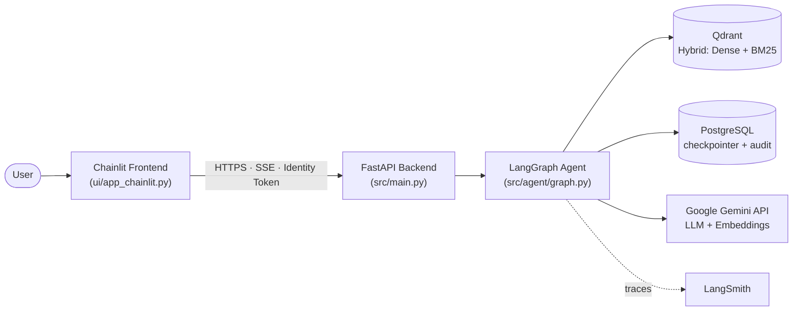
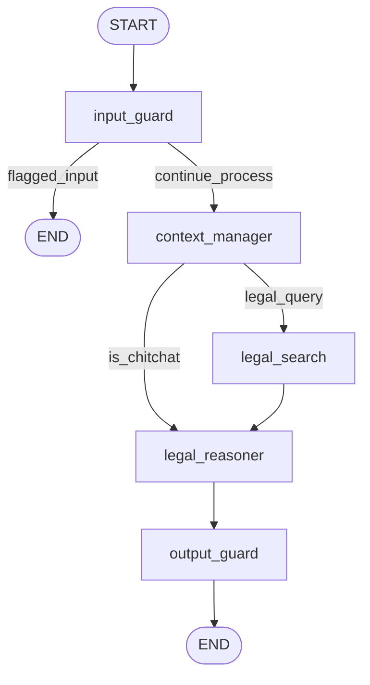
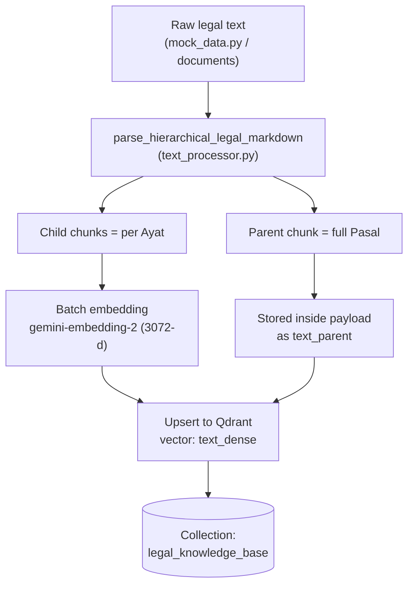
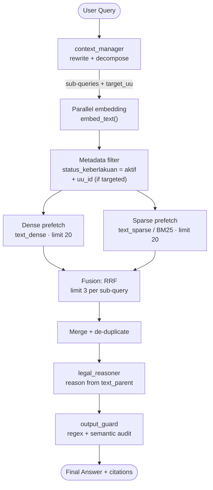
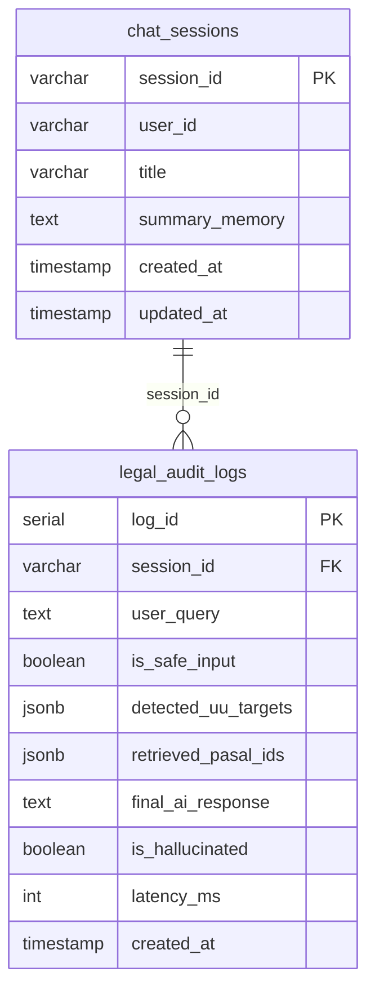
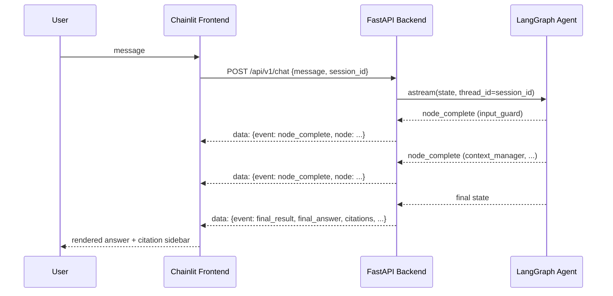

# Architecture

> Technical architecture of the **Legal RAG Assistant** — an agentic Retrieval-Augmented
> Generation chatbot for Indonesian labour law (*Hukum Ketenagakerjaan*).
>
> This document is **synchronised with the current codebase**. Where behaviour is
> described, it reflects what actually runs in `src/` today.

---

## Table of Contents

1. [Overview](#1-overview)
2. [System Architecture](#2-system-architecture)
3. [Agent Graph (LangGraph)](#3-agent-graph-langgraph)
4. [RAG Pipeline](#4-rag-pipeline)
   - [4.1 Ingestion Pipeline (Offline)](#41-ingestion-pipeline-offline)
   - [4.2 Retrieval &amp; Generation Pipeline (Online)](#42-retrieval--generation-pipeline-online)
5. [Data Model](#5-data-model)
6. [Interaction Flow (SSE)](#6-interaction-flow-sse)
7. [Design Decisions &amp; Trade-offs](#7-design-decisions--trade-offs)
8. [Code Reference](#8-code-reference)

---

## 1. Overview

The system is an **Agentic RAG** application. Unlike a naive RAG pipeline
(`retrieve → generate`), the flow is orchestrated as a state machine built with
**LangGraph**. Five nodes process the conversation, and two of them apply
*guardrails* (safety checks) around the LLM:

```
Input Guard → Context Manager → Legal Search → Legal Reasoner → Output Guard
```

Three ideas drive the design:

- **Evidence-based answers.** The reasoner may only answer from retrieved legal
  passages and must cite the specific *UU / Pasal / Ayat*. If the answer is not in
  the knowledge base, it must refuse instead of inventing.
- **Guardrails on both ends.** Input Guard blocks prompt-injection / hate speech;
  Output Guard blocks hallucinated article references (a two-layer check).
- **Hybrid retrieval.** Qdrant performs dense (semantic) *and* sparse (BM25 keyword)
  search in one query, fused with Reciprocal Rank Fusion (RRF).

### Technology Stack

| Layer               | Technology                                             |
| ------------------- | ------------------------------------------------------ |
| Language / tooling  | Python`>=3.12,<3.15`, `uv`, Ruff, mypy, pre-commit |
| Agent orchestration | LangGraph                                              |
| LLM & embeddings    | Google Gemini (`google-genai`)                       |
| Vector database     | Qdrant (dense + sparse / BM25)                         |
| Relational database | PostgreSQL (LangGraph checkpointer + business tables)  |
| Backend API         | FastAPI + Uvicorn (async, SSE streaming)               |
| Frontend            | Chainlit                                               |
| Observability       | LangSmith (tracing)                                    |
| Evaluation          | Ragas                                                  |
| Packaging / deploy  | Docker (multi-stage), Google Cloud Run                 |

---

## 2. System Architecture

The application is split into two deployable services (backend and frontend),
backed by two data stores and two external providers.

### 2.1 Macro Diagram



### 2.2 Components

| Component      | Code entry point                               | Responsibility                                                     |
| -------------- | ---------------------------------------------- | ------------------------------------------------------------------ |
| Frontend       | `ui/app_chainlit.py`                         | Chat UI, per-node progress, citation sidebar, session id (UUID)    |
| Backend API    | `src/main.py`, `src/api/v1/chat.py`        | HTTP layer, lifespan (DB pools + graph compilation), SSE streaming |
| Agent          | `src/agent/graph.py` + `src/agent/nodes/*` | Orchestrates the 5-node workflow                                   |
| Config         | `src/config.py`                              | Loads secrets from`.env.{APP_ENV}` via Pydantic Settings         |
| Connections    | `src/database/connection.py`                 | Async Postgres pool + Async Qdrant client                          |
| Embeddings     | `src/utils/embeddings.py`                    | Parallel Gemini embeddings                                         |
| Cloud Run auth | `src/utils/gcp_auth.py`                      | Injects GCP Identity Token when`APP_ENV=production`              |

### 2.3 Runtime Environments

| Concern          | Development                                                                             | Production                                                     |
| ---------------- | --------------------------------------------------------------------------------------- | -------------------------------------------------------------- |
| Data stores      | Docker Compose (`docker-compose.dev.yml`): Qdrant `v1.19.1`, Postgres `16-alpine` | Managed Qdrant Cloud + managed PostgreSQL (e.g. Neon/Supabase) |
| Backend port     | `7000` (`uvicorn --reload`)                                                         | Cloud Run dynamic`$PORT`                                     |
| Frontend port    | `8000` (`chainlit`)                                                                 | Cloud Run dynamic`$PORT`, `--headless`                     |
| Backend exposure | `localhost`                                                                           | VPC-internal,`--no-allow-unauthenticated`                    |
| Auth to backend  | none                                                                                    | Cloud Run Identity Token (see`src/utils/gcp_auth.py`)        |

> Deployment, CI/CD pipelines and Google Cloud specifics are documented separately
> in [`DEPLOYMENT.md`](./DEPLOYMENT.md).

---

## 3. Agent Graph (LangGraph)

The workflow is a `StateGraph` defined in `src/agent/graph.py`. It has **five nodes**
and two conditional routing points.

### 3.1 Graph Diagram



- `route_after_input_guard` — if `system_status == "flagged_input"`, jump straight to
  `END`; otherwise continue to `context_manager`.
- `route_after_context` — if `is_chitchat` is `true`, skip retrieval and go directly to
  `legal_reasoner`; otherwise run `legal_search`.
- `output_guard` always routes to `END`.

### 3.2 Nodes

| # | Node                | File                                | Gemini model              | Temperature | Role                                                                                                   |
| - | ------------------- | ----------------------------------- | ------------------------- | ----------- | ------------------------------------------------------------------------------------------------------ |
| 1 | `input_guard`     | `src/agent/nodes/input_guard.py`  | `gemini-3.5-flash-lite` | `0.0`     | Blocks prompt injection, jailbreak and hate speech/harassment                                          |
| 2 | `context_manager` | `src/agent/nodes/context.py`      | `gemini-3.5-flash-lite` | `0.0`     | Routes chit-chat vs legal query; rewrites / decomposes the query into sub-queries and metadata filters |
| 3 | `legal_search`    | `src/agent/nodes/search.py`       | — (embeddings only)      | —          | Async parallel hybrid search against Qdrant                                                            |
| 4 | `legal_reasoner`  | `src/agent/nodes/reasoner.py`     | `gemini-3.5-flash-lite` | `0.2`     | Composes the legal answer from retrieved passages (citations required)                                 |
| 5 | `output_guard`    | `src/agent/nodes/output_guard.py` | `gemini-3.5-flash-lite` | `0.0`     | Two-stage hallucination audit of the answer                                                            |

Each node reads from and writes to a shared `LegalAgentState`
(`src/agent/state.py`).

### 3.3 State (`LegalAgentState`)

| Field                   | Type                                          | Written by          | Purpose                                               |
| ----------------------- | --------------------------------------------- | ------------------- | ----------------------------------------------------- |
| `messages`            | `list[BaseMessage]` (with `add_messages`) | API / nodes         | Conversation history                                  |
| `search_payloads`     | `list[dict]`                                | `context_manager` | Sub-queries`{query, target_uu}` for retrieval       |
| `search_filters`      | `dict`                                      | `context_manager` | `{is_chitchat, chitchat_response, search_payloads}` |
| `retrieved_documents` | `list[dict]`                                | `legal_search`    | Retrieved legal chunks (payloads)                     |
| `system_status`       | `str`                                       | guards              | `clear` / `flagged_input` / `flagged_output`    |
| `final_answer`        | `str`                                       | reasoner / guards   | Curated answer returned to the user                   |

---

## 4. RAG Pipeline

The RAG system has two phases: an **offline ingestion** phase that populates Qdrant,
and an **online retrieval & generation** phase executed per user turn.

### 4.1 Ingestion Pipeline (Offline)

Implemented under `ingestion/mock/` (the executable pipeline). Data is parsed into a
**parent–child** structure: a *parent* = one full `Pasal`, a *child* = one `Ayat`.



Steps (see `ingestion/mock/ingest.py`):

1. **Parse** the raw text into chunks (`parse_hierarchical_legal_markdown`).
   Regex locators detect `BAB` and `Pasal` boundaries; each `(n)` marker becomes a
   child `Ayat`. If a `Pasal` has no numbered clauses, it is stored as a single
   `Ayat = 1`.
2. **Batch** the chunks (`BATCH_SIZE = 100`).
3. **Embed** the `text_child` of every chunk in the batch (parallel Gemini calls).
4. **Upsert** `PointStruct`s with `vector={"text_dense": ...}` into
   `legal_knowledge_base`. The sparse `text_sparse` vector is **not** sent manually —
   Qdrant builds it server-side from the indexed `text_child` field (BM25).

Each stored payload:

| Field                  | Description                                                       |
| ---------------------- | ----------------------------------------------------------------- |
| `uu_id`              | Stable identifier, e.g.`UU Ketenagakerjaan`, `UU Cipta Kerja` |
| `nama_regulasi`      | Human-readable name, e.g.`UU No 13 Tahun 2003`                  |
| `bab`                | Current chapter, tracked by character position                    |
| `pasal`              | Article number                                                    |
| `ayat`               | Clause number (`"1"` when there are no sub-clauses)             |
| `text_child`         | The clause text used for embedding / keyword search               |
| `text_parent`        | The full article text handed to the reasoner                      |
| `status_keberlakuan` | `"aktif"` (used as a search filter)                             |

> **Legacy code notice.** `ingestion/chunking.py` and `ingestion/6_chunks/chunking.py`
> are earlier ChromaDB + `torch` experiments and are **not** part of the running
> pipeline. `ingestion/{chunker,config,loader,run_ingestion}.py` are empty stubs. The
> supported entry point is `ingestion/mock/run_mock_ingest.py`.

### 4.2 Retrieval & Generation Pipeline (Online)

Executed inside the agent nodes on every legal question.



Key details:

- **Query rewriting / decomposition** — `context_manager` returns a list of
  `search_payloads` (`query`, `target_uu`). Complex questions become several
  sub-queries; chit-chat is routed away from retrieval entirely.
- **Metadata filtering** — every search filters on `status_keberlakuan = "aktif"`, and
  adds a `uu_id` filter when `target_uu != "Semua"` (`src/agent/nodes/search.py`).
- **Hybrid search** — a single `query_points` call issues two `Prefetch` branches:
  dense (`using="text_dense"`) and sparse BM25
  (`models.Document(text=..., model="Qdrant/bm25")`, `using="text_sparse"`), each with
  `limit=20`, fused by `models.FusionQuery(fusion=models.Fusion.RRF)`, returning the
  top **3** points per sub-query.
- **Parallelism** — all sub-queries are embedded and searched concurrently via
  `asyncio.gather`.
- **Generation** — the reasoner is fed each document's `text_parent` and must cite
  article numbers; if nothing relevant is retrieved, it returns a refusal message.

---

## 5. Data Model

Two data stores are used: **Qdrant** (vectors + legal payloads) and **PostgreSQL**
(agent memory + business/audit tables).

### 5.1 Qdrant Collection

Collection `legal_knowledge_base`, created by `src/database/init_qdrant.py`.

| Aspect        | Configuration                                                    |
| ------------- | ---------------------------------------------------------------- |
| Dense vector  | `text_dense` — size **3072**, distance **Cosine** |
| Sparse vector | `text_sparse` — `Modifier.IDF` (server-side BM25)           |
| Payload index | `text_child` — full-text, `TokenizerType.WORD`, lowercase   |
| Payload index | `status_keberlakuan` — keyword                                |

Payload schema per point: `uu_id`, `nama_regulasi`, `bab`, `pasal`, `ayat`,
`text_child`, `text_parent`, `status_keberlakuan`.

> ⚠️ `init_qdrant.py` **deletes any existing collection of the same name** before
> recreating it, so running it re-initialises (wipes) the knowledge base.

### 5.2 PostgreSQL

Created by `src/database/init_postgres.py`.



In addition to these application tables, the **LangGraph PostgreSQL checkpointer**
(`AsyncPostgresSaver.setup()`) creates its own tables, which persist conversation
state per `thread_id` (the session id sent by the frontend).

---

## 6. Interaction Flow (SSE)

The chat endpoint streams Server-Sent Events so the UI can show live progress and render
citations.



### 6.1 Endpoints

| Method   | Path             | Description                                                    |
| -------- | ---------------- | -------------------------------------------------------------- |
| `GET`  | `/health`      | Liveness probe →`{"status": "healthy", "environment": ...}` |
| `POST` | `/api/v1/chat` | Streams the agent run as SSE                                   |

Request body: `{ "message": str, "session_id": str }`.

### 6.2 SSE Events

| Event             | Payload fields                                                                                   | Emitted when                       |
| ----------------- | ------------------------------------------------------------------------------------------------ | ---------------------------------- |
| `node_complete` | `event`, `node`                                                                              | After each LangGraph node finishes |
| `final_result`  | `event`, `session_id`, `final_answer`, `system_status`, `is_chitchat`, `citations[]` | Once, at the end of the run        |

Each citation is `{ uu_id, pasal, ayat, text_child }`. The frontend maps node names to
Indonesian status labels and shows citations as side elements
(`ui/app_chainlit.py`).

> **Note.** The SSE layer emits the *final* answer as a single `final_result` event
> (no token-level streaming); `node_complete` events only carry the node name.

---

## 7. Design Decisions & Trade-offs

| Decision                                            | Rationale                                                                                                                                                                                        | Trade-off                                                        |
| --------------------------------------------------- | ------------------------------------------------------------------------------------------------------------------------------------------------------------------------------------------------ | ---------------------------------------------------------------- |
| **Hierarchical parent–child chunking**       | Embed fine-grained clauses (`text_child`) for precise matching, but hand the full article (`text_parent`) to the LLM for complete context                                                    | Larger payloads stored per point                                 |
| **Hybrid search (dense + sparse/BM25) + RRF** | Legal queries mix semantic paraphrase with exact terms (article numbers, "pesangon"); BM25 catches literal matches, dense catches meaning; RRF is rank-based so no score normalisation is needed | More complex query construction; two prefetch branches per query |
| **Server-side BM25 (`Qdrant/bm25`, IDF)**   | No separate sparse-embedding pipeline to maintain — Qdrant builds the sparse index from the indexed`text_child` payload                                                                       | Ties sparse behaviour to Qdrant's tokenizer/IDF                  |
| **Two-layer Output Guard**                    | Stage 1 (deterministic regex on cited`Pasal` numbers) is cheap and catches fabricated articles instantly; Stage 2 (Gemini semantic audit) catches meaning-level hallucination                  | Extra LLM call adds latency per answer                           |
| **Evidence-based reasoner prompt**            | Legal domain requires verifiable citations; the model must refuse when evidence is absent                                                                                                        | May refuse questions the model "knows" but that aren't in the KB |
| **Two guard nodes (input + output)**          | Separate safety concerns: prompt-injection/hate on input, factual accuracy on output                                                                                                             | More nodes and API calls in the graph                            |
| **Postgres checkpointer for memory**          | Durable, queryable, shared across stateless Cloud Run instances                                                                                                                                  | Adds a managed Postgres dependency                               |
| **Async end-to-end**                          | The workload is I/O-bound (Gemini, Qdrant, Postgres);`asyncio.gather` overlaps independent calls                                                                                               | Requires async clients and careful lifespan handling             |
| **SSE streaming**                             | Progressive UX (per-node status) with a plain HTTP stack                                                                                                                                         | No token-level streaming in the current implementation           |

### Known Gaps (documented, not yet implemented)

- No cross-encoder **reranker** — the pipeline goes straight from RRF fusion to the
  reasoner (`top-3` per sub-query).
- No **retry loop** — `output_guard` ends the run; a blocked answer is not regenerated.
- `evaluation/` scripts import `legal_agent_app` and reference a `node_retriever`
  interrupt, which do **not** match the current `graph.py` API (`compile_legal_graph`).
- `ingestion/` top-level modules are stubs; only the `ingestion/mock/` pipeline runs.

---

## 8. Code Reference

| Concept                             | Location                              |
| ----------------------------------- | ------------------------------------- |
| FastAPI app, lifespan, CORS         | `src/main.py`                       |
| Chat SSE endpoint                   | `src/api/v1/chat.py`                |
| Settings / env loading              | `src/config.py`                     |
| Logging                             | `src/logger.py`                     |
| Graph definition & routing          | `src/agent/graph.py`                |
| State schema                        | `src/agent/state.py`                |
| Prompts                             | `src/agent/prompts.py`              |
| Input Guard node                    | `src/agent/nodes/input_guard.py`    |
| Context Manager node                | `src/agent/nodes/context.py`        |
| Hybrid Search node                  | `src/agent/nodes/search.py`         |
| Reasoner node                       | `src/agent/nodes/reasoner.py`       |
| Output Guard node                   | `src/agent/nodes/output_guard.py`   |
| Async Postgres pool & Qdrant client | `src/database/connection.py`        |
| Qdrant collection init              | `src/database/init_qdrant.py`       |
| PostgreSQL tables init              | `src/database/init_postgres.py`     |
| Embeddings helper                   | `src/utils/embeddings.py`           |
| Cloud Run identity auth             | `src/utils/gcp_auth.py`             |
| Frontend chat UI                    | `ui/app_chainlit.py`                |
| Ingestion entry point               | `ingestion/mock/run_mock_ingest.py` |
| Ingestion logic                     | `ingestion/mock/ingest.py`          |
| Legal text parser                   | `ingestion/mock/text_processor.py`  |

---

_This document reflects the codebase at the current `main` revision. For running the
project locally and for deployment/CI details, see the root `README.md` and
[`DEPLOYMENT.md`](./DEPLOYMENT.md)._
