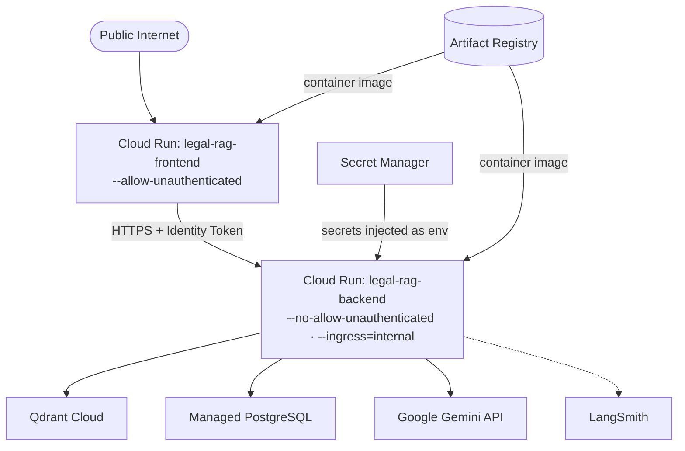
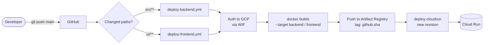

# Deployment

> How the **Legal RAG Assistant** is packaged and shipped to production.
>
> This is a **reference** document: it describes what the current pipeline does.
> It intentionally contains **no one-time cloud setup walkthrough** — that
> infrastructure is assumed to already exist. Identity-specific values
> (project, service account, Workload Identity provider) are shown as
> placeholders.

---

## Table of Contents

1. [Overview](#1-overview)
2. [Deployment Topology](#2-deployment-topology)
3. [CI/CD Pipeline](#3-cicd-pipeline)
4. [Container Image](#4-container-image)
5. [Configuration & Secrets](#5-configuration--secrets)
6. [IAM & Networking](#6-iam--networking)
7. [Runtime Operations](#7-runtime-operations)
8. [Known Issues & Caveats](#8-known-issues--caveats)
9. [Reference](#9-reference)

---

## 1. Overview

| Aspect | Value |
| --- | --- |
| Platform | Google Cloud Run (serverless containers) |
| Region | `asia-southeast2` |
| Services | `legal-rag-backend`, `legal-rag-frontend` |
| Image registry | Google Artifact Registry, repo `legal-rag-assistant` |
| CI/CD | GitHub Actions (two workflows) |
| Auth from CI to GCP | Workload Identity Federation (keyless) |

The system ships as **two independent Cloud Run services** built from one
multi-stage `Dockerfile`. A push to `main` triggers the matching workflow, which
builds the image, pushes it to Artifact Registry, and deploys a new revision.

### Assumed Prerequisites (not covered here)

The pipelines below assume the following already exist in the target GCP project:
a Google Cloud project, an Artifact Registry repository, a Workload Identity
Federation pool/provider, a deployer service account, the required IAM roles, the
Secret Manager secrets (see [§5](#5-configuration--secrets)), and the GitHub
repository variables used by the workflows. Provisioning these is out of scope
for this document.

---

## 2. Deployment Topology



- The **frontend** is publicly reachable; the **backend** is VPC-internal only, so
  it cannot be called from the internet directly.
- The frontend reaches the internal backend by attaching a Cloud Run **Identity
  Token** (see [§6](#6-iam--networking)) obtained from the instance metadata server
  in `src/utils/gcp_auth.py`.
- Secrets are injected into the backend container as environment variables from
  **Secret Manager** at deploy time (see [§5](#5-configuration--secrets)).

---

## 3. CI/CD Pipeline

Two GitHub Actions workflows deploy independently, each filtered by path so that a
change only redeploys the affected service.



### 3.1 Workflow Triggers

| Workflow | File | Trigger | Watched paths |
| --- | --- | --- | --- |
| Backend | `.github/workflows/deploy-backend.yml` | `push` to `main` | `src/**`, `Dockerfile`, `pyproject.toml`, `uv.lock`, workflow file |
| Frontend | `.github/workflows/deploy-frontend.yml` | `push` to `main` | `ui/**`, `.chainlit/**`, `Dockerfile`, `pyproject.toml`, `uv.lock`, workflow file |

### 3.2 Shared Pipeline Steps

Both workflows run the same sequence:

| Step | Action | Purpose |
| --- | --- | --- |
| Checkout | `actions/checkout@v4` | Fetch the repository |
| Authenticate | `google-github-actions/auth@v2` | Keyless auth to GCP via Workload Identity Federation |
| Registry login | `docker/login-action@v4` | Log in to `<REGION>-docker.pkg.dev` |
| Buildx | `docker/setup-buildx-action@v3` | Enable BuildKit feature set |
| Build & push | `docker/build-push-action@v6` | Build the target stage and push to Artifact Registry |
| Deploy | `google-github-actions/deploy-cloudrun@v2` | Create a new Cloud Run revision |

- Images are pushed as
  `<REGION>-docker.pkg.dev/<PROJECT_ID>/legal-rag-assistant/<backend|frontend>:<git-sha>`.
- The frontend build additionally uses GitHub Actions cache
  (`cache-from`/`cache-to`, `type=gha,scope=frontend`).

### 3.3 Cloud Run Deploy Flags

| Service | Flags |
| --- | --- |
| `legal-rag-backend` | `--no-allow-unauthenticated --ingress=internal --max-instances=5` |
| `legal-rag-frontend` | `--allow-unauthenticated --network=default --subnet=default --vpc-egress=all-traffic --max-instances=5` |

The frontend's `--vpc-egress=all-traffic` over the default network/subnet is what
allows it to reach the internal-only backend.

### 3.4 Authentication (Workload Identity Federation)

Workflows authenticate without long-lived keys using:

| Parameter | Value (placeholder) |
| --- | --- |
| `workload_identity_provider` | `projects/<PROJECT_NUMBER>/locations/global/workloadIdentityPools/<POOL>/providers/<PROVIDER>` |
| `service_account` | `github-deployer@<PROJECT_ID>.iam.gserviceaccount.com` |
| `audience` | `https://iam.googleapis.com/projects/<PROJECT_NUMBER>/locations/global/workloadIdentityPools/<POOL>/providers/<PROVIDER>` |

---

## 4. Container Image

A single multi-stage `Dockerfile` produces both runtime targets.

| Stage | `FROM` | Purpose |
| --- | --- | --- |
| `base` | `ghcr.io/astral-sh/uv:python3.11-bookworm-slim` | Install dependencies with `uv sync --frozen --no-dev --no-editable`, copy source, set `APP_ENV=production`, put `/app/.venv/bin` on `PATH` |
| `backend` | `base` | Runs the FastAPI app |
| `frontend` | `base` | Runs Chainlit; sets `PYTHONPATH=/app` so `src` is importable from `ui/` |

Container commands:

| Target | Command |
| --- | --- |
| `backend` | `uvicorn src.main:app --host 0.0.0.0 --port $PORT` |
| `frontend` | `chainlit run ui/app_chainlit.py --host 0.0.0.0 --port ${PORT:-8080} --headless` |

- Both commands bind to Cloud Run's injected `$PORT`.
- The frontend always runs `--headless` so it never tries to open a browser in the
  container.
- `ENV APP_ENV=production` makes `src/config.py` treat the environment as
  production (note the [caveat in §8](#8-known-issues--caveats)).

Build a target locally:

```bash
docker build --target backend  -t legal-rag-backend:local  .
docker build --target frontend -t legal-rag-frontend:local .
```

---

## 5. Configuration & Secrets

The backend receives configuration from two sources at deploy time: **GitHub
repository variables** (non-sensitive, via `env_vars`) and **Secret Manager**
(sensitive, via `secrets`).

### 5.1 Backend

| Env var | Source | GitHub reference | Notes |
| --- | --- | --- | --- |
| `APP_ENV` | Repo variable | `vars.ENVIRONMENT` | `production` in prod |
| `LOG_LEVEL` | Repo variable | `vars.LOG_LEVEL` | e.g. `INFO` |
| `LANGSMITH_TRACING` | Repo variable | `vars.LANGSMITH_TRACING` | `true`/`false` |
| `LANGSMITH_PROJECT` | Repo variable | `vars.LANGSMITH_PROJECT` | Tracing project name |
| `QDRANT_URL` | Secret Manager | `QDRANT_URL:latest` | Qdrant endpoint |
| `POSTGRES_URL` | Secret Manager | `POSTGRES_URL:latest` | Connection string |
| `GEMINI_API_KEY` | Secret Manager | `GEMINI_API_KEY:latest` | Google Gemini key |
| `QDRANT_API_KEY` | Secret Manager | `QDRANT_API_KEY:latest` | Qdrant key |
| `LANGSMITH_API_KEY` | Secret Manager | `LANGSMITH_API_KEY:latest` | LangSmith key |

> `src/config.py` declares `LANGSMITH_API_KEY` as **required**, so the secret must
> exist even when `LANGSMITH_TRACING=false`.

### 5.2 Frontend

| Env var | Source | GitHub reference | Notes |
| --- | --- | --- | --- |
| `APP_ENV` | Repo variable | `vars.ENVIRONMENT` | Enables identity-token auth |
| `BACKEND_URL` | Repo variable | `vars.BACKEND_URL` | Backend base URL used by `ui/app_chainlit.py` |

The frontend needs **no secrets** — it only calls the backend over HTTP.

### 5.3 Required GitHub Repository Variables

| Variable | Used by |
| --- | --- |
| `ENVIRONMENT` | Backend + frontend |
| `LOG_LEVEL` | Backend |
| `LANGSMITH_TRACING` | Backend |
| `LANGSMITH_PROJECT` | Backend |
| `BACKEND_URL` | Frontend |

### 5.4 Required Secret Manager Secrets

`QDRANT_URL`, `POSTGRES_URL`, `GEMINI_API_KEY`, `QDRANT_API_KEY`,
`LANGSMITH_API_KEY` — each referenced at version `latest`.

---

## 6. IAM & Networking

The backend is intentionally not publicly accessible, which shapes the IAM and
network configuration.

| Concern | Configuration |
| --- | --- |
| Backend ingress | `--ingress=internal` — only traffic from the VPC/internal networks |
| Backend auth | `--no-allow-unauthenticated` — callers must present a valid Identity Token |
| Frontend ingress | Public (`--allow-unauthenticated`) |
| Frontend egress | `--network=default --subnet=default --vpc-egress=all-traffic` — routes outbound traffic through the VPC so it can reach the internal backend |
| Deployer identity | Service account assumed by the workflows via Workload Identity Federation |

### Caller authentication

`src/utils/gcp_auth.py` implements a custom `httpx.Auth` flow:

1. Only activates when `APP_ENV=production`.
2. Requests an **Identity Token** from the instance metadata server
   (`http://metadata.google.internal/.../identity`) with the backend URL as the
   `audience`.
3. Attaches it as `Authorization: Bearer <token>`.

**Required IAM (assumed to exist):** the frontend's runtime service account must be
able to invoke the backend — i.e. `roles/run.invoker` on `legal-rag-backend`. The
deployer service account must have the permissions needed to push images and deploy
Cloud Run services.

---

## 7. Runtime Operations

| Concern | Behaviour |
| --- | --- |
| Logging | `src/logger.py` emits **structured JSON** (Loguru `serialize=True`) when `ENVIRONMENT=production`, plain text otherwise; logs go to stdout and are captured by Cloud Run/Cloud Logging |
| Scaling | `--max-instances=5` per service; scale-to-zero by default |
| Revisions | Every deploy creates a new immutable revision tagged with the Git SHA |
| Rollback | Shift traffic to a previous Cloud Run revision (redeploy/traffic-split) |
| Cold start | Postgres pool is sized small (`min_size=1`, `max_size=5`) for serverless |
| DB initialisation | Not automated by CI; run via Makefile targets (`make init-qdrant-prod`, `make ingest-qdrant-prod`) which use `APP_ENV=production` |

---

## 8. Known Issues & Caveats

These are documented as-is (not fixed) to keep the deployment reference accurate.

| # | Issue | Impact / Notes |
| --- | --- | --- |
| 1 | Dockerfile base image is **Python 3.11**, while `pyproject.toml` requires `>=3.12,<3.15` | `uv sync` relies on uv resolving a compatible interpreter; aligning the base image to `python3.12` is recommended |
| 2 | Environment file naming: `src/config.py` reads `.env.<APP_ENV>`, and `APP_ENV=production` implies **`.env.production`**, but the repo file is named **`.env.prod`** | Only matters for *local* production runs; in Cloud Run, variables are injected directly as env vars, so `.env.*` files are not used |
| 3 | `LANGSMITH_API_KEY` is a **required** setting in `src/config.py` | The secret must always be provided, even when tracing is disabled |
| 4 | `init_qdrant.py` **deletes** the existing collection before recreating it | `make init-qdrant-prod` wipes and re-creates `legal_knowledge_base` |

---

## 9. Reference

| File | Role |
| --- | --- |
| `Dockerfile` | Multi-stage image: `base` → `backend` / `frontend` |
| `.dockerignore` | Excludes `.venv`, caches, `.env*`, `data/`, `tests/`, docs from the build context |
| `.github/workflows/deploy-backend.yml` | Build & deploy the backend |
| `.github/workflows/deploy-frontend.yml` | Build & deploy the frontend |
| `src/utils/gcp_auth.py` | Cloud Run Identity Token auth for backend calls |
| `src/config.py` | Environment variable loading (`APP_ENV` → `.env.<env>`) |
| `src/logger.py` | Structured JSON logging in production |
| `Makefile` | `init-qdrant-prod`, `ingest-qdrant-prod` operations |
| `docker-compose.dev.yml` | Local development data stores (not used in production) |

---

_See [`ARCHITECTURE.md`](./ARCHITECTURE.md) for how the application itself is
structured. For local development and running the stack, see the root `README.md`._

